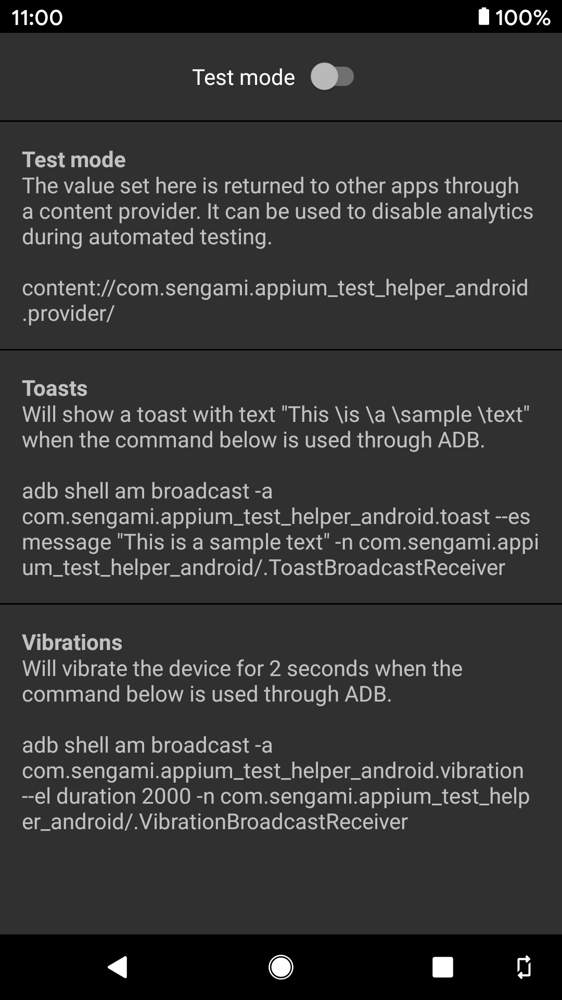

### Appium Test Helper Android  
&nbsp;   
  
##### Test mode  
The value set here is returned to other apps through a content provider. It can be used to disable analytics during automated testing. Since Android 11 apps can lose visibility of this content provider after some time or a reboot, launch this app immediately before running any tests to make sure the permissions are freshly granted. [Sample integration](https://github.com/KamilSucharski/sample_testable_app_android)    
content://com.sengami.appium_test_helper_android.provider/  
  
##### Toasts  
Will show a toast with text "This \is \a \sample \text" when the command below is used through ADB.  
adb shell am broadcast -a com.sengami.appium_test_helper_android.toast --es message \"This is a sample text\" -n com.sengami.appium_test_helper_android/.ToastBroadcastReceiver  
  
##### Vibrations  
Will vibrate the device for 2 seconds when the command below is used through ADB.  
adb shell am broadcast -a com.sengami.appium_test_helper_android.vibration --el duration 2000 -n com.sengami.appium_test_helper_android/.VibrationBroadcastReceiver  
  
[Download now on Google Play Store](https://play.google.com/store/apps/details?id=com.sengami.appium_test_helper_android)